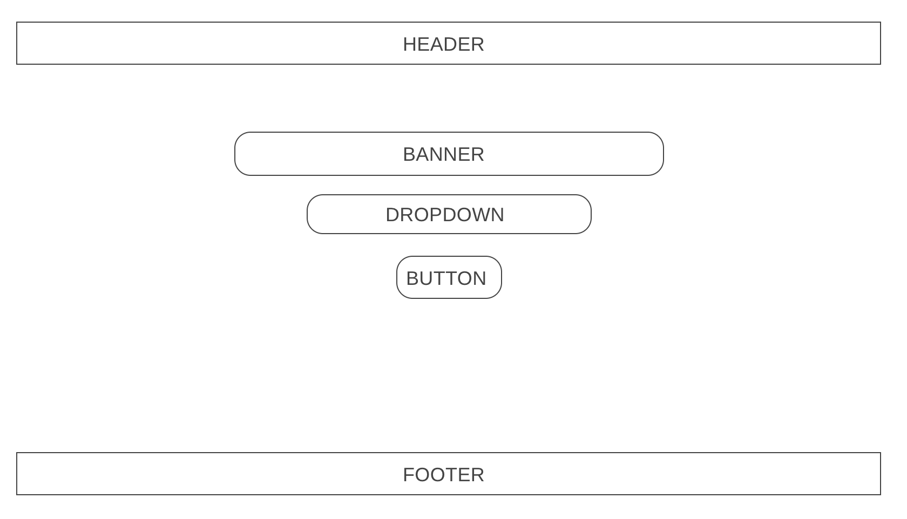
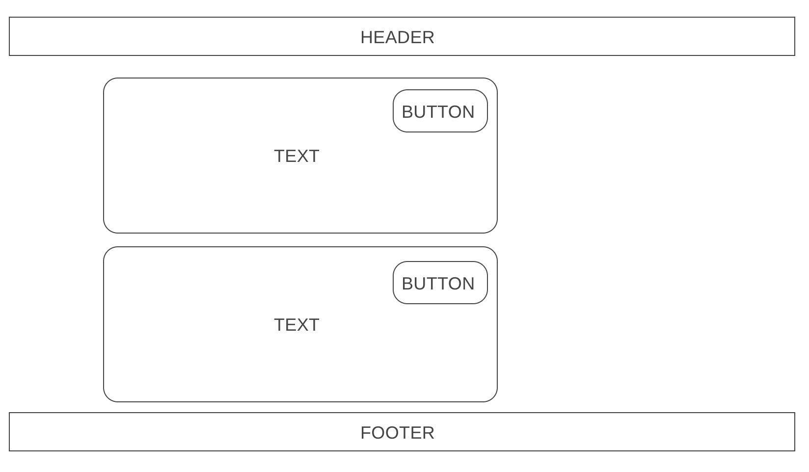
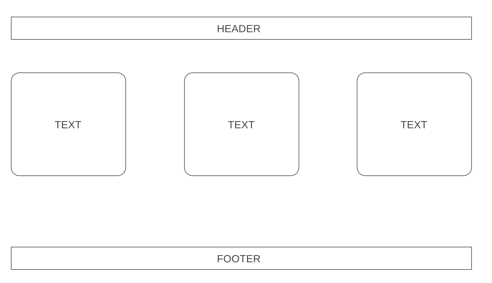
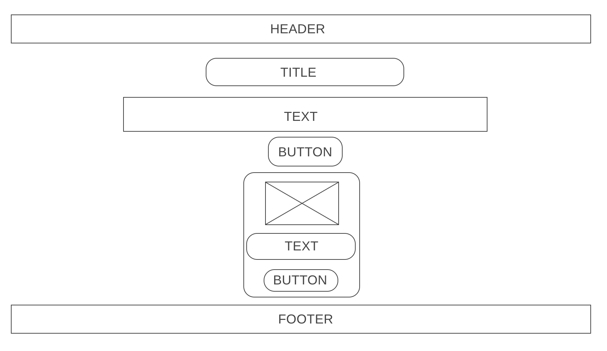
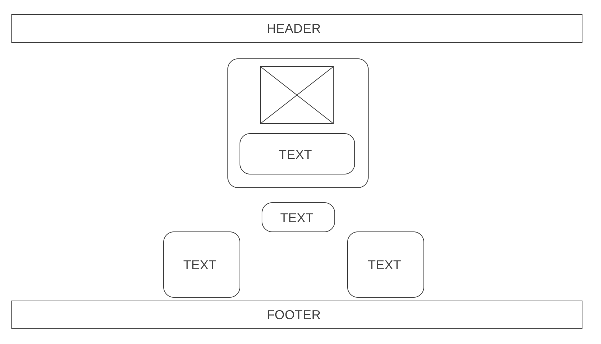
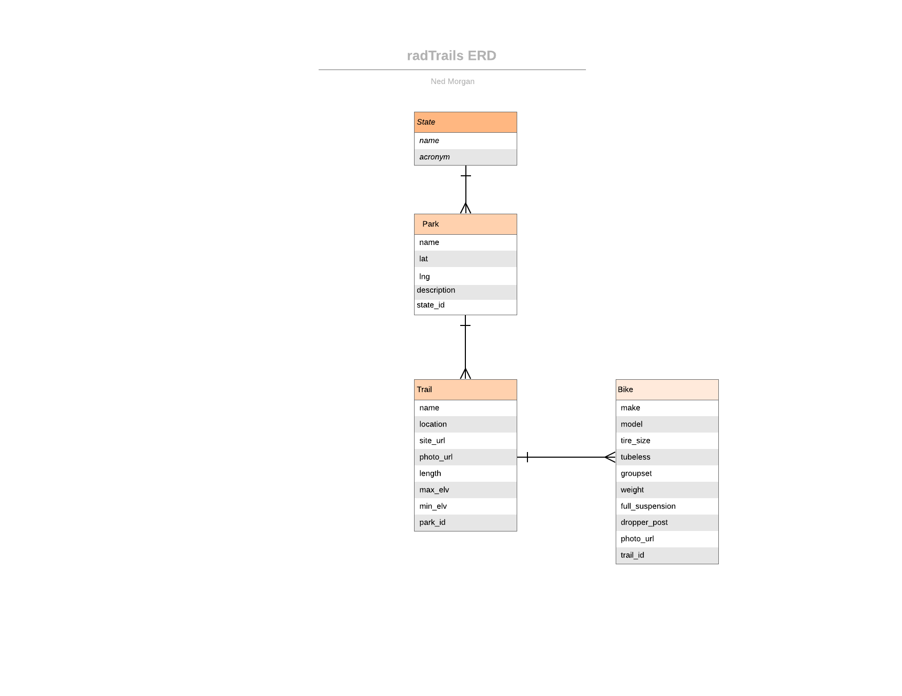

# radTrails

Through this application you are able to see the national parks in each state. Once you have saved a state and added a national park you want to visit you are able to search for mountain bike trails within a certain radius. Once you have found a trail you want to ride you can add different bikes to each trail you want to shred.

[Deployed Heroku Site](https://rad-trails.herokuapp.com/)

[Trello](https://trello.com/b/3cPNl746/mtb-national-parks)

## radTrails Features:

* The user is able to search for national parks within a specified state.
* The user is able to search for trails within a given radius close to that national park.
* The user add and delete states and national parks.
* In the application the user can add trails close to national parks they want to visit.
* The user is able to delete a trail if they are no longer interested.
* Once on a trail page, the user is able to add, update, and delete bike components.

## Wireframe:

### Home Page

### Dashboard Page

### Park Search Results

### Parks Page

### Trail Page

### ERD

## Technologies:

* Languages - Javascript, HTML, and CSS
* Front-End Frameworks - Bulma
* Back-End Framework - Django (Python)
* Database - PostgreSQL
* Libraries - React
* Design - Google Fonts and Responsive methodologies
* Visual Studio Code

## Features and Future Improvements:

#### Current Features

* Able to view, create, and delete states
* Able to view, create, and delete national parks
* Able to view, create, and delete trails
* Able to view, create, update, and delete bikes
* Able to view the trails location on google maps through an outside link
* Able to view specific information about a trail through an mtbProject link

___

#### Future Improvements:

* In Version 2 of this application I would like to have a map that calculates the distance from the national park to the trail.

* I would like to be able to integrate any ride data from Strava when riding a trial.

## Credits

Background Photo by Maksymilian Śleziak on Unsplash
